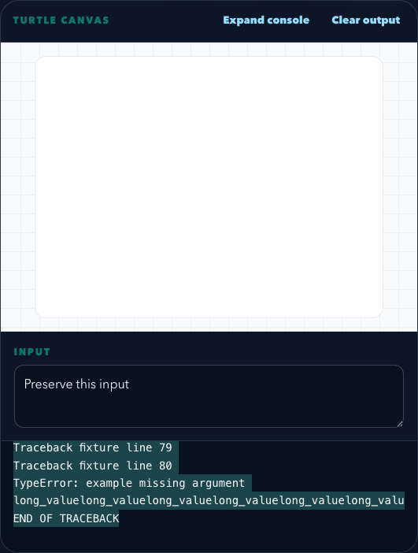

# Console and argument checks

The console scrolls independently of the canvas and page. Use **Expand console**
to give it the full output panel, then **Restore view** to return to the canvas
and input. Canvases fit the available height without changing their proportions.
Expanding keeps the program, output, and input intact. Click console
text before pressing **Cmd+A** (Mac) or **Ctrl+A** (Windows/Linux) to select only
the console output. Arrow keys and End also work while the console has focus.

This screenshot uses synthetic traceback text, not a student project.

Python and Java editors underline calls missing required arguments before Run
is clicked. Hover the underline or warning marker for details. Checks update
as code is edited and do not prevent running it.

These are conservative checks of definitions in the current file, not a full
type checker. They support Python defaults, keywords, positional-only and
keyword-only parameters, bound methods, constructors, and Java overloads and
varargs. Imported functions, unresolved receivers, dynamic or ambiguous bindings,
and unknown inherited Java overloads are left to runtime. Incomplete syntax is
handled by the existing syntax checks. Analysis is bounded to 200,000 characters,
30,000 syntax nodes, and 100 argument warnings per document.

All analysis happens in the browser without executing or submitting student code.
The browser regression test covers six IDE modes at five viewport sizes, console
scrolling and expansion, both selection shortcuts, and warnings before execution
and after correction. It uses synthetic output to keep layout checks independent
of runtime downloads.
