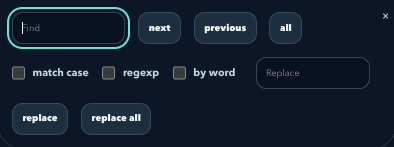

# Turtle manual updates and editor search contrast

`screen.tracer(0)` now separates logical Turtle state from the last displayed
scene. Commands still update positions and retain every pen-down line, but do
not schedule intermediate animation frames. `screen.update()` publishes the
whole accumulated drawing at once. Turning tracing back on publishes pending
work and resumes normal animation.

The displayed scene retains its own commands, poses, background, coordinate
mapping, and registered shapes. Resizing the canvas or expanding/restoring the
console redraws that scene without exposing pending changes. The IDE’s Clear output control and
new runs discard the prior frame. Execution remains entirely in the browser.

With an update every 1,000 simulation steps, all 1,000 line segments appear
together. Tracing controls when drawing becomes visible; it does not discard
intermediate pen-down segments. This follows the [Python Turtle animation
controls](https://docs.python.org/3/library/turtle.html#animation-control).

The editor search/replace buttons explicitly remove CodeMirror's default light
gradient and text shadow so site theme colors remain readable in both modes.

## Verification

Run `node --test test/turtle-tracer-browser.test.mjs` through the shared heavy-task
wrapper. The test executes the reported orbit equations in the browser's Python
runtime, checking unchanged pixels before step 1,000, the explicit update,
subsequent hidden movement, resizing, console restoration, pending clear and
background changes, normal animation after re-enabling tracing, and stop/clear.
It checks updates while the canvas is hidden, too.
It also measures search/replace text contrast in light and dark mode (at least
4.5:1). CI runs this regression alongside the existing IDE browser checks.

